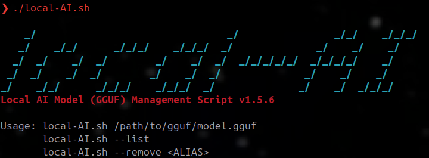

# Local AI Model (GGUF) Management Script

A tiny Bash helper for listing, launching, and removing local **GGUF** models (Ollama-friendly), utilizing VSCodium and the Continue extension to aid with local coding / development.

---

## 📣 Banner



---

## 🧭 Usage

```text
Usage: 
  local-AI.sh /path/to/gguf/model.gguf
  local-AI.sh --list
  local-AI.sh --remove <ALIAS>

Options:
  -h, --help               Show this help screen
  -l, --list               List Ollama models
  -r, --remove ALIAS       Remove model alias AND purge related files
```

---

### Quick examples

```bash
# Show help (banner + version + usage)
./local-AI.sh --help

# Launch a specific GGUF model
./local-AI.sh ~/models/llama-3.1-8b-instruct.Q4_K_M.gguf

# List installed Ollama models
./local-AI.sh --list

# Remove an alias and its artifacts
./local-AI.sh --remove llama-3.1-8b-instruct
```

---

## 🛠️ Install

```bash
curl -fsSL https://example.com/local-AI.sh -o local-AI.sh
chmod +x local-AI.sh
```

---

## 📄 License

MIT — see `LICENSE` for details.
